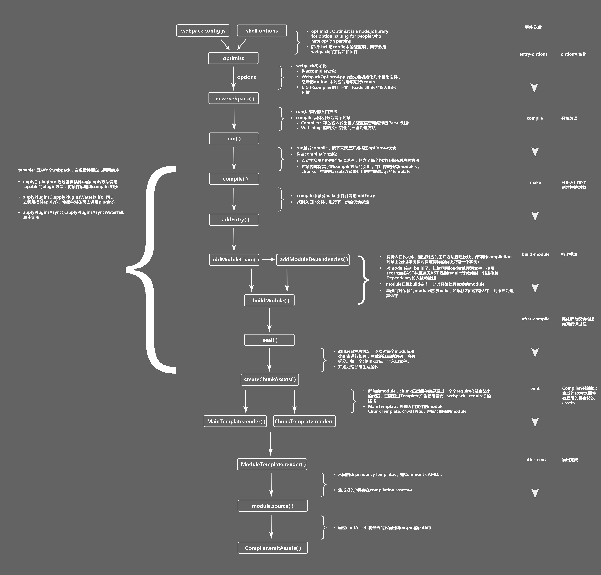

# 4. Plugin

## 常见 plugin


### html

* [html-webpack-plugin](https://github.com/jantimon/html-webpack-plugin)

方便生成 HTML 文件，默认零配置，如果没有指定 html 文件，默认会生成一个，production 模式下会自动压缩 html。如果想生成多个 html 文件，只需要多个 `new HtmlWebpackPlugin()` 即可。

如果使用模版文件，在模版中可以通过 `htmlWebpackPlugin` 访问此插件提供的数据，比如：

```html
<% if (htmlWebpackPlugin.files.favicon) { %>
<link rel="shortcut icon" href="<%= htmlWebpackPlugin.files.favicon%>">
<% } %>
```

更多关于编写模版的知识可以参考[这里](https://github.com/jantimon/html-webpack-plugin#writing-your-own-templates)。

几个比较重要的配置属性：

* `chunk`: 只包含指定的文件到 html 中，eg: `"chunk": ["common", "vue"]，在多入口配置中非常有用
* `excludeChunks`: 要屏蔽的 chunk


### 样式

* [`mini-css-extract-plugin`]()

此插件推荐用于生产环境，用来将 CSS 抽取到单独的文件，每一个含有 CSS 的 JS 文件都会生成一个，支持 CSS 的按需加载和 sourceMap。

* [`optimize-css-assets-webpack-plugin`](https://github.com/NMFR/optimize-css-assets-webpack-plugin)

一个支持开发环境热加载以及生产环境抽离 CSS 文件的配置:

```js
const MiniCssExtractPlugin = require("mini-css-extract-plugin");
const devMode = process.env.NODE_ENV !== 'production';
const OptimizeCSSAssetsPlugin = require("optimize-css-assets-webpack-plugin");
const cssnano = require("cssnano");

module.exports = {
  plugins: [
    new MiniCssExtractPlugin({
      filename: devMode ? '[name].css' : '[name].[contenthash].css',
      chunkFilename: devMode ? '[id].css' : '[id].[contenthash].css',
    }),
    new OptimizeCSSAssetsPlugin({
      cssProcessor: cssnano,
      cssProcessorOptions: options,
      canPrint: false,
    }),
  ],
  module: {
    rules: [
      {
        test: /\.(sa|sc|c)ss$/,
        use: [
          devMode ? 'style-loader' : MiniCssExtractPlugin.loader,
          'css-loader',
          'postcss-loader',
          'sass-loader',
        ],
      }
    ]
  }
}
```
### JS

* `terser-webpack-plugin` (不建议使用 `uglifyjs-webpack-plugin` )

结合 `optimization.minimize` 和 `optimization.minimizer` 配置

```js
const TerserPlugin = require('terser-webpack-plugin');

module.exports = {
  optimization: {
    minimizer: [
      new TerserPlugin({
        cache: true,
        parallel: true,
        compress: {}, // 压缩选项，注意默认会丢掉 debugger
        mangle: true, // 函数、变量命名压缩
      }),
    ],
  },
};
```

### 其它

* [clean-webpack-plugin](https://github.com/johnagan/clean-webpack-plugin)

删除某个目录。

```js
const CleanWebpackPlugin = require('clean-webpack-plugin');

plugins: [
  // 第一个参数指定清除的目录
  // 'dist' 删除 dist 文件夹
  // 'dist/*.*' 删除 dist 文件夹下所有文件
  // 'dist/*.js' 删除 dist 下所有 JS 文件
  new CleanWebpackPlugin(['dist'], {
    root: __dirname, // 根目录
  }),
  // ...
]
```

* [`copy-webpack-plugin`](https://github.com/webpack-contrib/copy-webpack-plugin)

复制文件或目录，常用在静态资源的搬运上。

```js
const CopyWebpackPlugin = require('copy-webpack-plugin');

new CopyWebpackPlugin([
  'relative/path/to/file.ext', // 复制到默认
  {
  context: __dirname, // 根目录
  from: 'static/*.png', // 或者 glob 模式的字符串
  to: 'dist/', // 目标
  force: true, // 强制覆盖
}])
```

* webpack.DefinePlugin

webpack 内置插件，提供定义在「**编译时**」使用（替换）的全局常量。

「注意」：如果给定值是字符串，会被当作代码，必须再加一层引号，所以最好使用 `JSON.stringify` 做转换。

```js
new webpack.DefinePlugin({
  PRODUCTION: JSON.stringify(true),
  VERSION: JSON.stringify('v3.2')
})
```

## 实现一个自己的 plugin

webpack 的工作流程可以参考下面这张图（来自博文[细说 webpack 之流程篇，作者: 七珏](http://taobaofed.org/blog/2016/09/09/webpack-flow/)）：



* compiler: 全局唯一，包含webpack 环境所有配置信息，webpack 从启动到执行，可以简单理解为是 webpack 实例。
* compilation: 包含当前的模块、编译生成资源、变化的文件等，是一次新的编译，webpack 以开发模式运行时，一次文件变化引起的重编译就是一个新的 compilation。

webpack 的运行过程中，贯穿着一条事件流，在特定的工作节点会发布特定的事件，只需要订阅对应的事件，提供回调方法，就可以在该事件发生时执行回调。而这种事件流的基础就是 [Tapable](https://github.com/webpack/tapable) 模块，它（确切的说其实是各种钩子）对外暴露 3 个方法：`tap`，`tapAsync`、`tapPromise`，插件通过这 3 个方法注入事件发布时应该执行的任务（回调方法），后两个方法会异步执行回调，需要注意的是不同的钩子支持的方法不同，比如 `SyncHook` 钩子就只能通过 `tap` 订阅，webpack 的 `Compiler` 和 `Compilation` 都是继承的 Tapable，比如 [`Compiler.js`](https://github.com/webpack/webpack/blob/master/lib/Compiler.js) 的部分源码如下：

```js
const {
	Tapable,
	SyncHook,
	SyncBailHook,
	AsyncParallelHook,
	AsyncSeriesHook
} = require("tapable");

// ...
class Compiler extends Tapable {
	constructor(context) {
		super();
		this.hooks = {
			/** @type {SyncBailHook<Compilation>} */
			shouldEmit: new SyncBailHook(["compilation"]),
			/** @type {AsyncSeriesHook<Stats>} */
			done: new AsyncSeriesHook(["stats"]),
      // ...
    }
  }
}
```

一个插件的基本组成：

* 一个命名类
* 一个名为 `apply` 的成员方法:
  - 指定一个需要监听的事件钩子
  - 操作 webpack 内部实例特定的数据（即监听事件的回调里传递过来的参数）
  - 调用 webpack 提供的 callback 声明操作完成（不依赖返回值的可以没有返回或者 callback，比如同步钩子）

比如：

```js
class HelloCompilationPlugin {
  apply(compiler) {
    // Tap into compilation hook which gives compilation as argument to the callback function
    compiler.hooks.compilation.tap('HelloCompilationPlugin', compilation => {
      // Now we can tap into various hooks available through compilation
      compilation.hooks.optimize.tap('HelloCompilationPlugin', () => {
        console.log('Assets are being optimized.');
      });
    });
  }
}

module.exports = HelloCompilationPlugin;
```

本文自定义两个插件：[`MyPlugin`](./plugins/MyPlugin.js) 和 [`MyPluginCreateEvent`](./plugins/MyPluginCreateEvent.js)，后者会自定义一个事件钩子，前者监听该钩子事件，在事件激活时打印事件传递的数据，具体插件定义见应的代码。

在 webpack 配置文件中引用自定义的插件：

```js
plugins: [
  // ...
  new MyPluginCreateEvent(),
  new MyPlugin()
],
// ...
```

执行 build 后会看到有这么一条日志：`****** MyPlugin received data: [ MyPluginCreateEvent is called ] ******`，说明自定义的插件正确运行了。

----

## 参考

1. https://webpack.js.org/contribute/writing-a-plugin/
2. http://taobaofed.org/blog/2016/09/09/webpack-flow/
