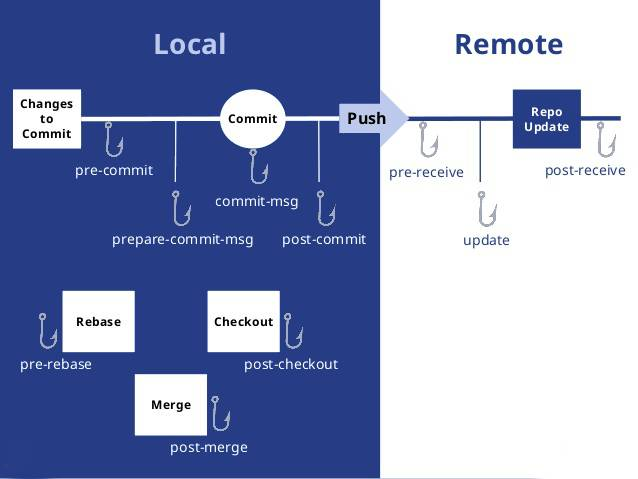

# 7. others

> // TODO:

* [x] [git commit message](./git-commit-msg.md)
* [ ] output type? (umd, commonjs ...)

## 先导知识 1: git hooks

勾子就是定义在 `$your_project/.git/hooks/` 下的脚本，在特定的事件（如`git commit`）被触发时会调用对应的勾子脚本。



在 node 项目，借助 [`husky`](https://github.com/typicode/husky)，可以让 git hook 触发时除了执行原有的勾子脚本外，执行配置的其它（多为 `npm` 相关）脚本：

```bash
# 安装
npm install husky -D
```

```json
"husky": {
  "hooks": {
    "pre-commit": "npm run lint"
  }
}
```

**TIP:** 如果是多个命令，可以借助 [`npm-run-all`](https://github.com/mysticatea/npm-run-all) 库（支持并行、顺序执行）。

